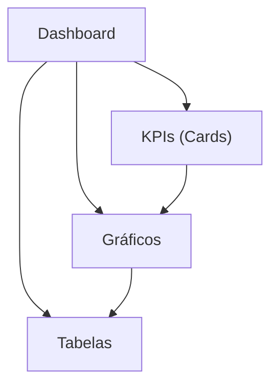

## 1. Product Overview
Novo layout do Dashboard ETI SENTINEL com foco em leitura rápida: sidebar fixa, KPIs em cards e seções claras para gráficos e tabelas.
Você usa o dashboard para monitorar indicadores, analisar tendências e conferir listas/ocorrências em um único lugar.

## 2. Core Features

### 2.1 User Roles
| Role | Registration Method | Core Permissions |
|------|---------------------|------------------|
| Usuário (padrão) | N/A (fora do escopo deste documento) | Acessar dashboard e visualizar KPIs, gráficos e tabelas |

### 2.2 Feature Module
O novo dashboard consiste nas seguintes páginas essenciais:
1. **Dashboard**: sidebar fixa, cabeçalho com contexto, cards KPI, seções de gráficos, seções de tabelas e estados de carregamento/erro.

### 2.3 Page Details
| Page Name | Module Name | Feature description |
|-----------|-------------|---------------------|
| Dashboard | Sidebar fixa | Navegar entre áreas do dashboard via itens de menu; destacar item ativo; manter fixa durante scroll. |
| Dashboard | Cabeçalho (Top bar) | Exibir título/identidade ETI SENTINEL e contexto da visualização (ex.: período selecionado); oferecer ações básicas de visualização (ex.: atualizar). |
| Dashboard | Cards KPI | Exibir KPIs principais em cards com valor, rótulo e variação/estado (quando aplicável); suportar clique/hover para evidenciar contexto. |
| Dashboard | Seção de gráficos | Exibir blocos de gráficos organizados em grid; apresentar título, legenda (se aplicável) e estado vazio quando não houver dados. |
| Dashboard | Seção de tabelas | Exibir tabelas com colunas essenciais, cabeçalho fixo (quando aplicável) e ordenação básica; apresentar estado vazio quando não houver dados. |
| Dashboard | Layout e responsividade | Manter sidebar fixa e conteúdo rolável; ajustar grid de KPIs/gráficos/tabelas para larguras menores mantendo legibilidade. |
| Dashboard | Feedback de estados | Mostrar carregamento, erro e “sem dados” de forma consistente em KPIs, gráficos e tabelas. |

## 3. Core Process
Fluxo principal (Usuário):
1. Você entra no Dashboard e vê a sidebar fixa com a navegação.
2. Você confere rapidamente os KPIs nos cards para identificar status/variações.
3. Você analisa tendências e distribuição nas seções de gráficos.
4. Você valida detalhes e listas operacionais nas tabelas (ordenando quando necessário).
5. Você atualiza a visualização quando precisar refletir dados mais recentes.

