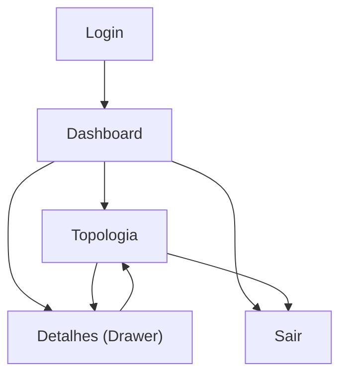

## 1. Product Overview
Dashboard desktop-first inspirado no estilo UniFi, com identidade visual ETI, para monitorar infraestrutura (devices de rede) e CFTV em tempo quase real.
Você usa o produto para ter uma visão rápida de saúde/alertas e, quando necessário, aprofundar na **Topologia** para entender relações (conexões/impacto) e agir sobre itens (conforme permissão).

## 2. Core Features

### 2.1 User Roles
| Papel | Método de cadastro | Permissões principais |
|------|---------------------|-----------------------|
| Operador | Convite do Admin / e-mail corporativo | Visualizar Dashboard e Topologia do(s) site(s) permitido(s); buscar/filtrar itens; abrir detalhes; abrir câmera ao vivo (quando disponível); reconhecer (ack) eventos quando permitido; executar ações não destrutivas (ex.: localizar/LED) |
| Admin | Convite + promoção de papel | Tudo de Operador; gerenciar contexto do site (inclui associação de usuários ao site); executar ações críticas (ex.: reiniciar/disable/enable) e ajustes de cadastro/adoção/remoção conforme política interna |

### 2.2 Feature Module
O produto é composto pelas seguintes páginas essenciais:
1. **Login**: autenticação, seleção de site (se aplicável).
2. **Dashboard**: visão geral do site, status/saúde, lista resumida de devices e CFTV, eventos/alertas.
3. **Topologia**: grafo interativo de devices e câmeras, filtros, painel de detalhes e ações.

### 2.3 Page Details
| Page Name | Module Name | Feature description |
|-----------|-------------|---------------------|
| Login | Autenticação | Entrar com e-mail/senha; validar campos; exibir erros; manter sessão; sair (logout). |
| Login | Seleção de contexto | Selecionar site ao entrar quando você tiver mais de um; persistir site selecionado para próximas aberturas. |
| Dashboard | Cabeçalho + navegação | Trocar site; acesso rápido para Topologia; busca global por nome/IP/MAC; indicador de última atualização; ação “Atualizar”. |
| Dashboard | KPIs (cards) | Exibir totais e estados: devices online/offline/alerta; câmeras online/offline; tráfego (up/down); latência média; número de alertas abertos. |
| Dashboard | Saúde por categoria | Mostrar distribuição por tipo (gateway/switch/ap/câmera/NVR) e severidade (ok/aviso/crítico). |
| Dashboard | Lista “Ativos críticos” | Listar até N itens offline/alerta com: nome, tipo, IP, última vez visto, severidade; abrir item na Topologia com foco. |
| Dashboard | CFTV resumo | Listar câmeras com status + snapshot (quando disponível); abrir ao vivo quando disponível; abrir na Topologia com foco. |
| Dashboard | Eventos/alertas recentes | Exibir timeline (últimas N ocorrências) com filtro rápido (crítico/aviso/info); reconhecer (ack) quando sua permissão permitir; refletir status reconhecido na lista. |
| Topologia | Canvas de grafo | Renderizar nós (devices/câmeras) e links; zoom/pan; mini-map; auto-layout; destacar conexões/caminhos ao selecionar. |
| Topologia | Filtros + busca | Filtrar por tipo, status, local (rack/andar), fabricante; buscar por nome/IP/MAC; alternar “Mostrar somente problema”. |
| Topologia | Painel de detalhes (drawer) | Exibir detalhes do item selecionado (identidade, saúde, métricas, portas/links, eventos recentes). |
| Topologia | Ações do item | Executar ações via botões conforme permissão: localizar/LED, reiniciar, habilitar/disable, abrir câmera ao vivo, copiar IP/MAC. |
| Topologia | Modo CFTV | Ao selecionar câmera: mostrar player ao vivo (quando disponível) com status do stream; fallback para snapshot + motivo quando indisponível. |

## 3. Core Process
**Fluxo Operador**: faz login → seleciona site (se necessário) → confere KPIs e alertas no Dashboard → usa busca/filtros para localizar um item crítico → abre “Ver na topologia” → analisa conexões/impacto no grafo → abre detalhes do device/câmera → executa ação permitida (ex.: localizar/LED) e/ou abre câmera ao vivo (quando disponível) → acompanha eventos recentes e reconhece (ack) quando permitido.

**Fluxo Admin**: faz login → seleciona site → no Dashboard identifica impacto (KPIs/ativos críticos/eventos) → vai para Topologia → filtra para isolar área → executa ações críticas (ex.: reiniciar/disable/enable) → valida recuperação por status/métricas → reconhece (ack) alertas.

