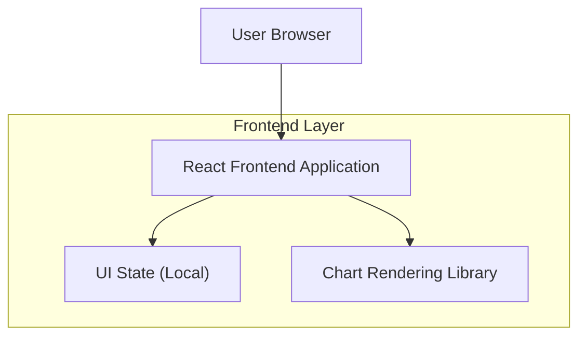

## 1.Architecture design

## 2.Technology Description
- Frontend: React@18 + vite + tailwindcss@3
- Backend: None
- UI/Charts: Biblioteca de gráficos para React (ex.: Recharts ou ECharts via wrapper React)

## 3.Route definitions
| Route | Purpose |
|-------|---------|
| / | Dashboard principal com sidebar fixa, KPIs, gráficos e tabelas |

## 4.API definitions (If it includes backend services)
N/A (sem backend no escopo).

## 5.Server architecture diagram (If it includes backend services)
N/A.

## 6.Data model(if applicable)
N/A (sem banco no escopo).
