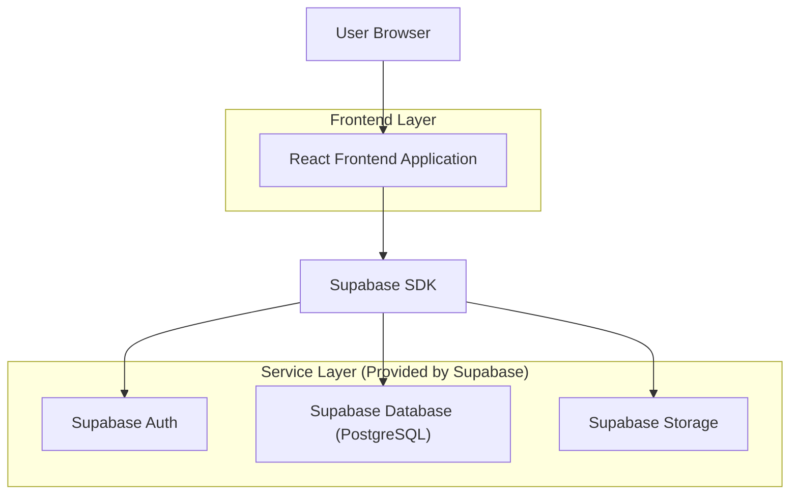
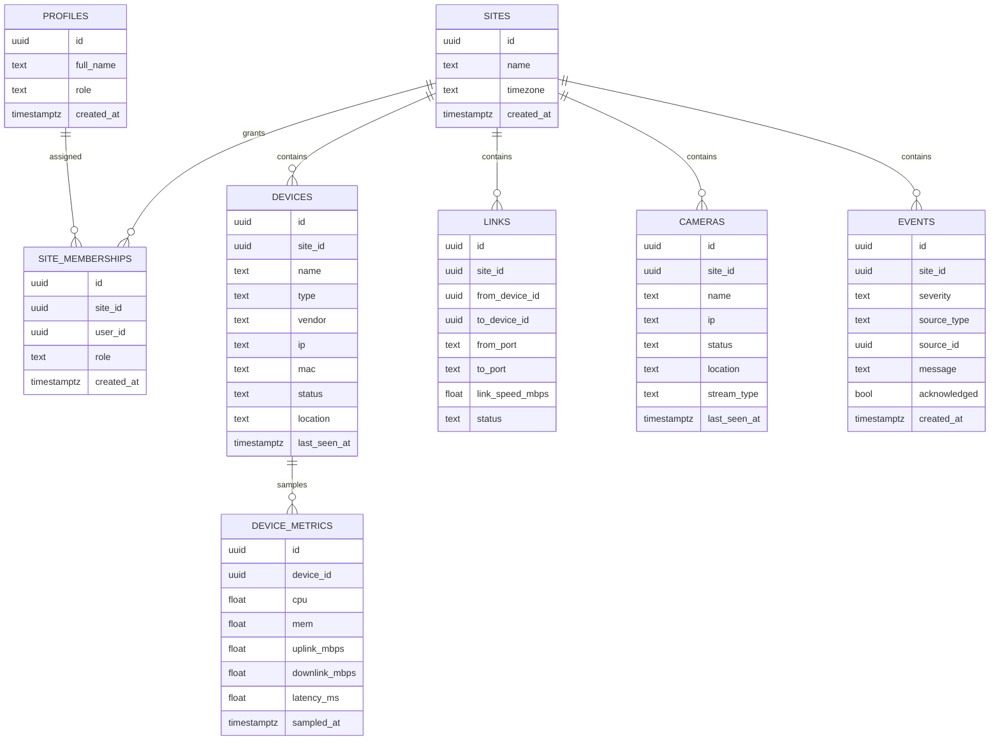

## 1.Architecture design



## 2.Technology Description

* Frontend: React\@18 + vite + TypeScript + tailwindcss\@3
* UI: biblioteca de grafo para topologia (ex.: React Flow) + biblioteca de gráficos (ex.: Recharts)

* Backend: Supabase (Auth + Postgres + Storage)

## 3.Route definitions

| Route      | Purpose                                                   |
| ---------- | --------------------------------------------------------- |
| /login     | Login e seleção de site (quando aplicável)                |
| /dashboard | Visão geral do site: KPIs, saúde, eventos, resumo CFTV    |
| /topologia | Grafo de devices/câmeras com filtros e drawer de detalhes |

## 6.Data model(if applicable)

### 6.1 Data model definition



### 6.2 Data Definition Language

Profiles (profiles)

```
CREATE TABLE profiles (
  id UUID PRIMARY KEY,
  full_name TEXT,
  role TEXT NOT NULL DEFAULT 'operator',
  created_at TIMESTAMPTZ NOT NULL DEFAULT NOW()
);
```

Sites (sites)

```
CREATE TABLE sites (
  id UUID PRIMARY KEY DEFAULT gen_random_uuid(),
  name TEXT NOT NULL,
  timezone TEXT DEFAULT 'America/Sao_Paulo',
  created_at TIMESTAMPTZ NOT NULL DEFAULT NOW()
);
```

Devices (devices) — sem FK física (usar chaves lógicas)

```
CREATE TABLE devices (
  id UUID PRIMARY KEY DEFAULT gen_random_uuid(),
  site_id UUID NOT NULL,
  name TEXT NOT NULL,
  type TEXT NOT NULL,
  vendor TEXT,
  ip TEXT,
  mac TEXT,
  status TEXT NOT NULL DEFAULT 'unknown',
  location TEXT,
  last_seen_at TIMESTAMPTZ
);
CREATE INDEX idx_devices_site_id ON devices(site_id);
CREATE INDEX idx_devices_status ON devices(status);
```

Site Memberships (site_memberships)

```
CREATE TABLE site_memberships (
  id UUID PRIMARY KEY DEFAULT gen_random_uuid(),
  site_id UUID NOT NULL,
  user_id UUID NOT NULL,
  role TEXT NOT NULL DEFAULT 'operator',
  created_at TIMESTAMPTZ NOT NULL DEFAULT NOW()
);
CREATE INDEX idx_site_memberships_site_id ON site_memberships(site_id);
CREATE INDEX idx_site_memberships_user_id ON site_memberships(user_id);
```

Device Metrics (device_metrics)

```
CREATE TABLE device_metrics (
  id UUID PRIMARY KEY DEFAULT gen_random_uuid(),
  device_id UUID NOT NULL,
  cpu DOUBLE PRECISION,
  mem DOUBLE PRECISION,
  uplink_mbps DOUBLE PRECISION,
  downlink_mbps DOUBLE PRECISION,
  latency_ms DOUBLE PRECISION,
  sampled_at TIMESTAMPTZ NOT NULL DEFAULT NOW()
);
CREATE INDEX idx_device_metrics_device_id_sampled_at ON device_metrics(device_id, sampled_at DESC);
```

Links (links)

```
CREATE TABLE links (
  id UUID PRIMARY KEY DEFAULT gen_random_uuid(),
  site_id UUID NOT NULL,
  from_device_id UUID NOT NULL,
  to_device_id UUID NOT NULL,
  from_port TEXT,
  to_port TEXT,
  link_speed_mbps DOUBLE PRECISION,
  status TEXT NOT NULL DEFAULT 'unknown'
);
CREATE INDEX idx_links_site_id ON links(site_id);
```

Cameras (cameras)

```
CREATE TABLE cameras (
  id UUID PRIMARY KEY DEFAULT gen_random_uuid(),
  site_id UUID NOT NULL,
  name TEXT NOT NULL,
  ip TEXT,
  status TEXT NOT NULL DEFAULT 'unknown',
  location TEXT,
  stream_type TEXT,
  last_seen_at TIMESTAMPTZ
);
CREATE INDEX idx_cameras_site_id ON cameras(site_id);
```

Events (events)

```
CREATE TABLE events (
  id UUID PRIMARY KEY DEFAULT gen_random_uuid(),
  site_id UUID NOT NULL,
  severity TEXT NOT NULL,
  source_type TEXT NOT NULL,
  source_id UUID,
  message TEXT NOT NULL,
  acknowledged BOOLEAN NOT NULL DEFAULT FALSE,
  created_at TIMESTAMPTZ NOT NULL DEFAULT NOW()
);
CREATE INDEX idx_events_site_id_created_at ON events(site_id, created_at DESC);
CREATE INDEX idx_events_ack ON events(acknowledged);
```

RLS (recomendado)

```
ALTER TABLE sites ENABLE ROW LEVEL SECURITY;
ALTER TABLE site_memberships ENABLE ROW LEVEL SECURITY;
ALTER TABLE devices ENABLE ROW LEVEL SECURITY;
ALTER TABLE links ENABLE ROW LEVEL SECURITY;
ALTER TABLE cameras ENABLE ROW LEVEL SECURITY;
ALTER TABLE events ENABLE ROW LEVEL SECURITY;
ALTER TABLE device_metrics ENABLE ROW LEVEL SECURITY;

-- exemplo (leitura do que pertence aos seus sites)
CREATE POLICY "read_sites_by_membership" ON sites
  FOR SELECT TO authenticated
  USING (EXISTS (SELECT 1 FROM site_memberships m WHERE m.site_id = sites.id AND m.user_id = auth.uid()));
```

Permissões (exemplo)

```
GRANT SELECT ON sites, site_memberships, devices, device_metrics, links, cameras, events TO anon;
GRANT ALL PRIVILEGES ON sites, site_memberships, devices, device_metrics, links, cameras, events TO authenticated;
```

