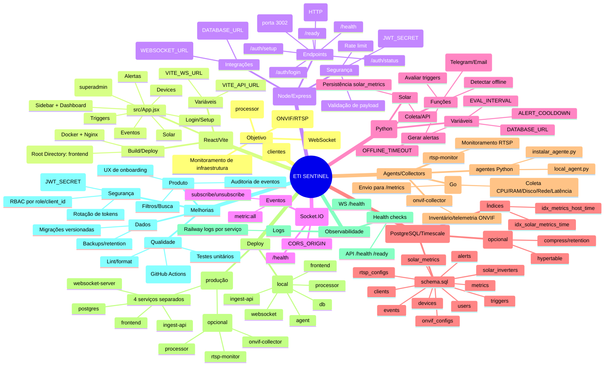

# ETI SENTINEL — Mapa mental do projeto

Este documento resume os módulos, fluxos e pontos de melhoria do ETI SENTINEL.

## Mindmap (Mermaid)

## Componentes (o que faz o quê)

- `frontend/` — Painel web (login/setup, dashboard, clientes, devices, triggers, alertas, eventos, solar).
- `ingest-api/` — API principal: autenticação, cadastro, ingestão de métricas, integração com Postgres e publicação para WS.
- `websocket-server/` — Canal realtime para o painel.
- `processor/` — Avaliador de triggers, offline e alertas + integrações de notificação + pipeline solar.
- `sql/schema.sql` — Schema completo do banco.
- `agent/` — Agente Go para coletar métricas e enviar para a API.
- `onvif-collector/` e `rtsp-monitor/` — coletores opcionais.

## Fluxos principais

### 1) Primeiro acesso
- Frontend chama `GET /auth/status`
- Se `setupDone=false`: mostra “CRIAR CONTA MASTER” (`POST /auth/setup`)
- Se `setupDone=true`: login (`POST /auth/login`) e guarda token

### 2) Ingestão de métricas
- Agent envia para `POST /metrics` com `X-Device-Token`
- API grava em `metrics` e atualiza `devices.last_seen/status`
- API publica resumo/stream para o WebSocket
- Frontend atualiza cards/tabela em tempo real

### 3) Alertas
- Processor lê `triggers` + `devices/metrics`
- Gera `alerts` e opcionalmente envia notificação (Telegram/Email)
- Frontend lista alertas e eventos

## Variáveis (Railway)

### ingest-api
- `DATABASE_URL`
- `JWT_SECRET`
- `CORS_ORIGIN`
- `WEBSOCKET_URL`

### websocket-server
- `PORT=3001`
- `CORS_ORIGIN`

### frontend
- `VITE_API_URL`
- `VITE_WS_URL`

### processor (se estiver em produção)
- `DATABASE_URL`
- `EVAL_INTERVAL`, `OFFLINE_TIMEOUT`, `ALERT_COOLDOWN`
- `TELEGRAM_TOKEN`, `TELEGRAM_CHAT_ID` (opcional)
- `SMTP_HOST`, `SMTP_PORT`, `SMTP_USER`, `SMTP_PASS`, `ALERT_EMAIL` (opcional)

## Checklist de melhorias (para você avaliar)

### Alta prioridade (impacto direto)
- Autenticação/RBAC: garantir isolamento por `client_id` em todos endpoints.
- Segredos: exigir `JWT_SECRET` forte e remover defaults em produção.
- Migrações: padronizar em uma pasta única e versionada (ex.: `migrations/NNN_*.sql`).
- Observabilidade: adicionar logs estruturados e correlação (request-id) na API.

### Média prioridade (qualidade e escala)
- Testes: Jest (Node), pytest (Python), testes de contrato para endpoints críticos.
- CI/CD: workflow com lint + build + testes + deploy.
- Performance: índices por `client_id`, paginação para lists, cache control no frontend.

### Produto/UX
- Onboarding guiado: criar cliente → criar device → gerar token → instalar agent.
- Dashboards por cliente, filtros salvos e “visões” (por tipo/tag/local).
- Auditoria: log de ações (criar/editar device/trigger) em `events`.

